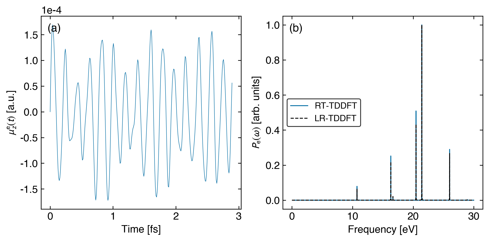

# HCN TDDFT calculations

- **calculate_lr_rt_tddft.py**: A sample Python script to calculate linear-response and time-dependent TDDFT excited states of a given molecule.

- **plot_rt_spectra_pade.py**: A sample Python script to plot electronic excited-state transitions using real-time TDDFT vs linear-response TDDFT calculated from **calculate_lr_rt_tddft.py**, where the real-time dipole info is stored in **rt_tddft_energy_dipoles_0.txt**, and the linear-response TDDFT states are stored in **psi4_lrtddft_output_id_0.txt**.

After running the above two Python scripts, we obtain the electronic spectrum of a single HCN molecule evaluated under time-dependent Hartree-Fock theory with the sto-3g basis set.

We can freely tune the functional and basis set in **calculate_lr_rt_tddft.py** for more accurate calculations.

